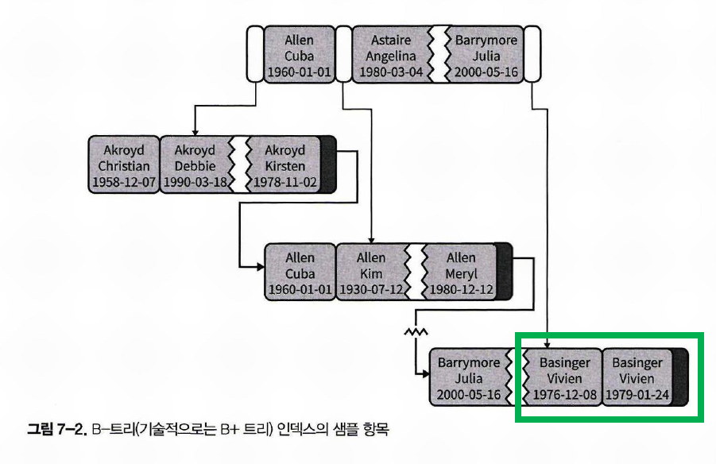

# B+Tree, B-Tree, InnoDB 에서 B+Tree

# 참고자료

- [위키백과 - B+Tree](https://ko.wikipedia.org/wiki/B%2B_%ED%8A%B8%EB%A6%AC)
- [B-Tree, B+Tree란?](https://zorba91.tistory.com/293)
- [Real MySQL - B-Tree 인덱스](https://12bme.tistory.com/138)
- [MySQL 성능 최적화](http://www.yes24.com/Product/Goods/112622445)

<br>

# 용어정리

**루트노드**<br>

B-Tree는 트리 구조의 최 상위에 루트노드가 있다. 그리고 그 하위에 자식 노드가 붙어있는 형태다.<br>

<br>

**리프노드**<br>

트리의 가장 하위에 있는 노드는 '리프노드'라고 한다.<br>

리프노드는 항상 실제 데이터 레코드를 찾아가기 위한 주소값을 가지고 있다.<br>

DB는 인덱스와 실제 데이터가 저장된 데이터를 따로 취급한다. 그런데 리프노드는 항상 실제 데이터 레코드를 찾기 위한 주소값을 가지고 있는다.<br>

<br>

**브랜치 노드**<br>

트리구조에서 루트노드,리프노드는 아니지만, 다른 노드의 부모가 되는 노드를 브랜치 노드라고 한다.<br>

<br>

# B-Tree 용어의 오용

많은 사람들이 B-Tree의 B가 바이너리(이진) 트리라고 잘못 생각하고 있다.<br>

B-Tree의 B는 Binary(이진)의 약자가 아니라, Balanced 의 약자를 의미한다.<br>

<br>

# B+Tree vs B-Tree

InnoDB에서는 B-Tree 라고 부르는 B-Tree 인덱스는 사실 B+Tree 를 조금 복잡하게 구현한 자료구조다. (참고 : [B-Tree, B+Tree란?](https://zorba91.tistory.com/293))<br>

그리고 일반적인 인덱스를 이야기할 때는 B-Tree 라는 용어로 혼용해서 부르는 경우가 많아 혼동을 만드는 경우가 많은 편이다.<br>

보통 InnoDB의 B+Tree 를 B-Tree라고 통칭하는데, 이번 문서에서는 B+Tree 라고 정리하기로 했다.<br>

InnoDB의 B+Tree 라는 말을 쓰는 것과 B-Tree 라고 부르는 것에 차이가 없기는 한데, B+Tree 를 정리하다가 B-Tree를 언급하다보니, B+Tree 라는 용어를 더 많이 사용해서 그냥 B+Tree 라고 적어두로 했다.<br>

혹시라도 면접이나 이런곳에서 이야기할 때는 그냥 B Tree 라고 부르면된다. <br>

망할 데이터베이스 엔진 개발자놈들... 이름 좀 하나로 부르란 말이다.<br>

<br>

# B+Tree 의 구조

B+Tree 는 브랜치 노드에 key만 담아두고 data는 담지 않는다.<br>

리프노드에만 key와 data를 저장한다. 그리고 리프노드 끼리는 Linked List로 연결되어 있다.<br>

실제 존재하는 단순한 B+트리는 아래와 같은 구조를 갖는다. (출처 : [위키백과 - B+Tree](https://ko.wikipedia.org/wiki/B%2B_%ED%8A%B8%EB%A6%AC))<br>


그림 출처 : [위키백과 - B+Tree](https://upload.wikimedia.org/wikipedia/commons/3/37/Bplustree.png) <br>

MySQL의 InnoDB는 이와 같은 B+Tree의 구조를 응용해 Double Linked List를 활용하는 등의 구조로 B+Tree 자료구조를 사용하고 있다.<br>

<br>

# B+Tree 의 장점

B+트리는, 모든 레코드들이 트리의 가장 하위 레벨에 정렬되어있다. B+트리 노드는 파일 시스템(strage context, file system)에서 검색이 효율적이다. <br>

B+Tree 는 바이너리 서치 트리에 비해  fanout이 훨씬 높아서 검색에 필요한 I/O 동작 회수를 줄일 수 있기에 파일 I/O시에 바이너리 서치 트리에 비해 장점을 갖는다.<br>

<br>

# B+Tree 가 주로 쓰이는 곳

B+Tree 는 주로 파일 시스템에서 사용되고 관계형 데이터베이스에서는 흔하게 사용되지 않는다. 가끔 관계형 DB에 B+Tree가 사용되는 경우가 있지만, 데이터베이스 시스템에서는 거의 사용되지 않는다.<br>

아래는 B+Tree 가 사용되는 Filesystem 의 종류들이다.

- ReiserFS filesystem (Unix and Linux)
- XFS filesystem (IRIX, Linux)
- JFS2 filesystem (AIX, OS/2, Linux)
- NTFS filesystem (Microsoft Windows)

<br>

MySQL의 InnoDB 스토리지 엔진은 B+Tree 를 사용한다.<br>

이 외에도 NDB Cluster 의 경우 T-Tree 라는 자료구조를 사용한다.<br>

<br>

# InnoDB의 B+Tree 자료구조

InnoDB의 B+Tree 자료구조는 일반적인 B+Tree 자료구조를 조금 더 복잡하게 구현한 구조다.<br>

- 같은 레벨의 노드들 끼리는 Double Linked List를 사용하고 있다.<br>

- 자식 노드로는 Single Linked List 로 연결되어 있다.<br>

<br>

위에서 B+Tree 의 구조에서 언급했듯 B+Tree 의 브랜치 노드, 리프노드는 각각 아래의 원칙으로 연결되어 있다.

- B+Tree 는 브랜치 노드에 key만 담아두고 data는 담지 않는다.<br>

- 리프노드에만 key와 data(value)를 저장한다. 그리고 리프노드 끼리는 Linked List로 연결되어 있다.<br>

<br>

InnoDB에서 사용하는 B+Tree 의 구조는 아래와 같다.


>  출처 :  [https://blog.jcole.us/2013/01/10/btree-index-structures-in-innodb/](https://blog.jcole.us/2013/01/10/btree-index-structures-in-innodb/)<br>

<br>

위에서 정리했든 브랜치 노드에는 항상 key만 담아두고 있다. 그리고 이 킷값의 비교를 통해 원하는 목적지가 위치한 아래 노드로 차례로 이동한다. 그리고 결과적으로는 리프노드에 도달하는데, 리프노드에는 key와 데이터(value)를 저장하고 있다. 이 리프노드에서는 디스크에 존재하는 데이터(value)의 주소값을 구할 수 있고, Linked List를 통해 리프노드간 탐색 역시 가능하다.<br>

<br>

# InnoDB의 B+Tree의 장점

InnoDB의 B+Tree는 인덱싱 된 열을 순서대로 저장하고 있기에 데이터 범위를 검색하는 데에 유용하다.<br>

예를 들어 텍스트 타입의 필드에 지정한 인덱스의 트리 내림 차순은 알파벳 순서로 값이 전달되기에, '1 \~ k 로 시작하는 모든 이름'을 찾을 때 효율적으로 탐색할 수 있다.<br>

<br>

# B+Tree 기반 인덱스의 정렬된 데이터의 형식

이번 문단에서는 예제를 통해 데이터가 어떤 형태로 정리되어 있는지를 단순하게 정리한다.<br>

예를 들어 아래와 같은 형식의 테이블을 정의해둔 상태라고 해보자.

```sql
CREATE TABLE People(
    last_name 	varchar(50) not null,
    first_name 	varchar(50) not null,
    dob			date 		not null,
    -- 인덱스 : last_name, first_name, dob
    key (last_name, first_name, dob)
);
```

<br>

위의 테이블에서 인덱스는 성 + 이름 + 출생년월 로 되어 있다.<br>

인덱스이기에 지정한 인덱스의 규칙에 따라 정렬되어 저장된다는 사실을 기억하자<br>

이렇게 지정된 인덱스는 B+Tree 에서는 아래 그림과 같은 방식으로 정렬되어 표현된다.<br>




> 검은색 포인터 : 다음 리프에 대한 포인터<br>
>
> 하얀색 포인터 : 하위 페이지에 대한 포인터<br>
>
> 회색 포인터 : 페이지에서의 값<br>
>
> 이미지 출처 : [MySQL 성능 최적화](http://www.yes24.com/Product/Goods/112622445)<br>

<br>

위의 그림에서 초록색 사각형으로 표시한 가장 마지막 두개의 리프노드를 자세히 보자.<br>

마지막에 있는 성이 `Basinger` 인 두개의 노드는 이름도 `Vivien` 으로 같다.<br>

그런데 출생 연도가 다르다.<br>

출생연도가 빠른 순으로 정렬되어 있는 것을 볼수 있다.<br>

이렇듯 우리가 편리하게 SQL문을 통해 ORDER BY를 지정하는 인덱스는 위와 같은 형식으로 내부적인 자료구조로 저장되어 있는데, 이렇기에 인덱스를 지정해 데이터를 조회할때, 인덱스를 생성할 때 신중히 컬럼을 지정해줘야 한다.<BR>

<BR>


