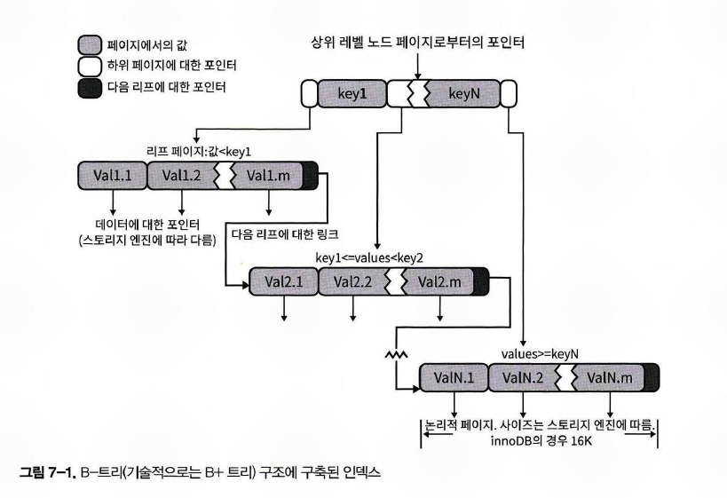

# MySQL의 B-Tree 인덱스

# B-Tree 용어의 오용

많은 사람들이 B-Tree의 B가 바이너리(이진) 트리라고 잘못 생각하고 있다. 

B-Tree의 B는 Binary(이진)의 약자가 아니라, Balanced 의 약자를 의미한다. 

 

# B+Tree vs B-Tree

InnoDB에서는 B-Tree 라고 부르는 B-Tree 인덱스는 사실 B+Tree 를 조금 복잡하게 구현한 자료구조다. (참고 : [B-Tree, B+Tree란?](https://zorba91.tistory.com/293)) 

 

## B+Tree

실제 원래 존재하는 단순한 B+트리는 아래와 같은 구조를 갖는다. (출처 : [위키백과 - B+Tree](https://ko.wikipedia.org/wiki/B%2B_%ED%8A%B8%EB%A6%AC)) 

그림 출처 : [위키백과 - B+Tree](https://upload.wikimedia.org/wikipedia/commons/3/37/Bplustree.png)  

 

**B+Tree 의 장점** 

B+트리는, 모든 레코드들이 트리의 가장 하위 레벨에 정렬되어있다. B+트리 노드는 파일 시스템(strage context, file system)에서 검색이 효율적이다.  

B+Tree 는 바이너리 서치 트리에 비해  fanout이 훨씬 높아서 검색에 필요한 I/O 동작 회수를 줄일 수 있기에 파일 I/O시에 바이너리 서치 트리에 비해 장점을 갖는다. 

 

**B+Tree 가 주로 쓰이는 곳** 

B+Tree 는 주로 파일 시스템에서 사용되고 관계형 데이터베이스에서는 흔하게 사용되지 않는다. 가끔 관계형 DB에 B+Tree가 사용되는 경우가 있지만, 데이터베이스 시스템에서는 거의 사용되지 않는다. 

아래는 B+Tree 가 사용되는 Filesystem 의 종류들이다.

- ReiserFS filesystem (Unix and Linux)
- XFS filesystem (IRIX, Linux)
- JFS2 filesystem (AIX, OS/2, Linux)
- NTFS filesystem (Microsoft Windows)

 

B+Tree 는 파일 시스템에서만 거의 채택되는 데에도 불구하고 B+Tree를 굳이 정리하는 이유는, B-Tree가 B+Tree의 변형이기 때문이다. 

 

## B-Tree

리프노드를 제외하고 데이터를 담아두지 ㅇ낳기 때문에 메모리를 더 확보할 수 있다. 따라서 더 많은 key 들을 수용할 수 있다.

# B-트리 인덱스의 구조

**루트노드** 

B-Tree는 트리 구조의 최 상위에 루트노드가 있다. 그리고 그 하위에 자식 노드가 붙어있는 형태다. 

**리프노드** 

트리의 가장 하위에 있는 노드는 '리프노드'라고 한다. 

리프노드는 항상 실제 데이터 레코드를 찾아가기 위한 주소값을 가지고 있다. 

DB는 인덱스와 실제 데이터가 저장된 데이터를 따로 취급한다. 그런데 리프노드는 항상 실제 데이터 레코드를 찾기 위한 주소값을 가지고 있는다. 

 

**브랜치 노드** 

트리구조에서 루트노드,리프노드는 아니지만, 다른 노드의 부모가 되는 노드를 브랜치 노드라고 한다. 

스토리지 엔진이 원하는 데이터를 찾기 위해 전체 테이블을 스캔할 필요가 없다. 전체 테이블을 스캔하지 않으므로 데이터 액세스 속도가 비교적 빠르다. 대신 루트 노드에서부터 시작한다.

